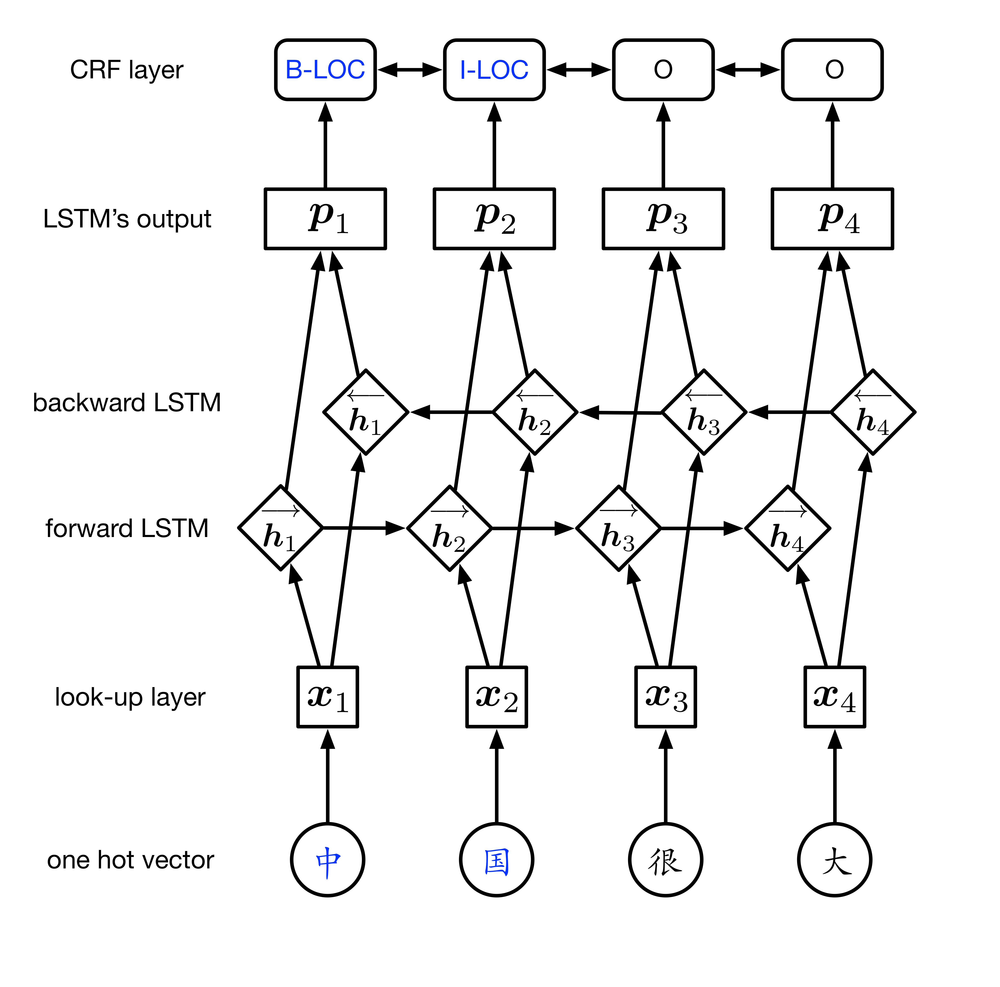

# Bi-LSTM + CRF model for Chinese Named Entity Recognition

This is an simple implementation of [Neural Architectures for Named Entity Recognition](<https://arxiv.org/pdf/1603.01360.pdf>) on Python3, Keras, and TensorFlow. We reimplement it and train it on a Chinese News dataset.


## Model

This model is similar to the models provided by Lample et al. Its structure is illustrated as following:

 

For one Chinese sentence, each character in this sentence has a tag of the set {O, B-PER, I-PER, B-LOC, I-LOC, B-ORG, I-ORG} .

The first layer is embedding look-up layer which trains an embedding vector for each word in sentence. We initialize the embedding matrix with a pretrained embedding — [wiki_100.utf8](./data/pretrain_embedding/wiki_100.utf8) .

The second layer is bidirectional long short-term memory network(LSTM) which captures the forward and backward context information of sentence and output a hidden vector for entity recognition.

The final layer is conditional random filed which captures connection of two adjoining labels, and classifies LSTM hidden vectors into corresponding classes.


## Dataset

This Chinese News dataset is widely used in github community but not acting as a Public dataset, we list the statistics as following:

| Data split | Sentence cont. | Entity cont. | PER cont. | LOC cont. | ORG cont. |
| ---------- | -------------- | ------------ | --------- | --------- | --------- |
| Train      | 20864          | 33992        | 8144      | 16571     | 9277      |
| Dev        | 2318           | 3819         | 884       | 1951      | 984       |
| Test       | 4636           | 7707         | 1864      | 3658      | 2185      |

### datafile

The directory `./data/example` contains 3 data files: train,develop and test file.

The directory `./data/pretrain_embedding` contains 1 pretrained embedding file: wiki_100.utf8

The directory `./model`  preserves trained model(.h5 file) and config file(.pkl file)

### dataformat

Sentences and labels are in B-I-O format(CoNLL format):

```
美     B-LOC
国     I-LOC
的     O
华     B-PER
莱     I-PER
士     I-PER
在     O
中     B-ORG
南     I-ORG
海     I-ORG
。     O
```

For custom dataset, you should transform into the format above and put it in `/data`  directory.


## How to Run

### Dependencies

- keras (>=2.1.4)
- keras_contrib(https://github.com/keras-team/keras-contrib)
- h5py
- pickle


For training steps:

`python3 train.py --epochs=50 --batch_size=200` 

The epochs and batch_size are hyperparameters which you can adjust by yourself.


For testing steps:

`python3 val.py`

It will read a sentence and extract the entities,  we share a sample here:

Input:

``` 
中华人民共和国国务院总理周恩来在外交部长陈毅,
副部长王东的陪同下，
连续访问了埃塞俄比亚等非洲10国以及阿尔巴尼亚
```

output:

```
['person: 周恩来 陈毅, 王东', 'location: 埃塞俄比亚 非洲 阿尔巴尼亚', 'organzation: 中华人民共和国国务院 外交部']
```


## Experimental Result

| Dataset | Precision | Recall | F value |
| ------- | --------- | ------ | ------- |
| Example | 0.8565    | 0.8274 | 0.8417  |


## Reference

\[1\]  [Neural Architectures for Named Entity Recognition](<https://arxiv.org/pdf/1603.01360.pdf>)

\[2\]  [https://github.com/Determined22/zh-NER-TF](https://github.com/Determined22/zh-NER-TF)

\[3\]  [https://github.com/stephen-v/zh-NER-keras](https://github.com/stephen-v/zh-NER-keras)


